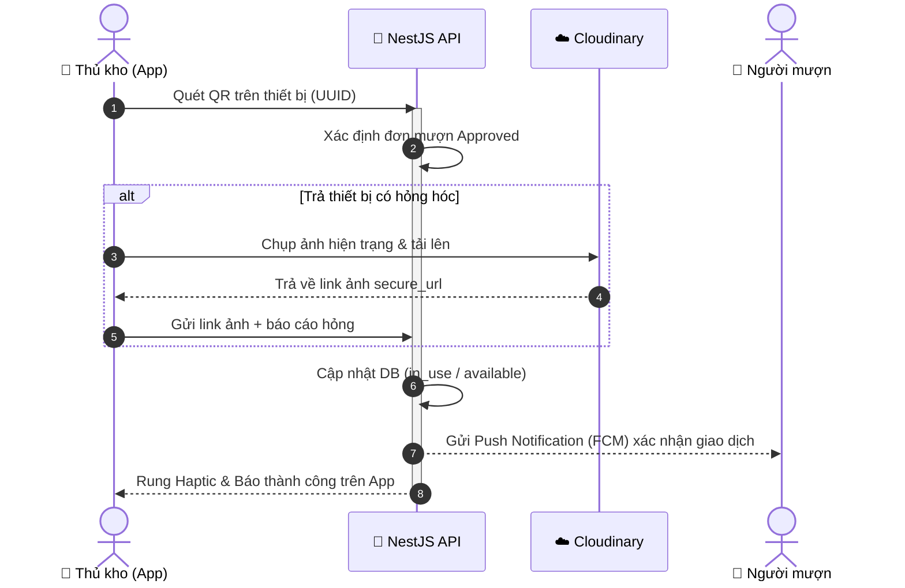

# 📱 BTL-EQM: Mobile Application

Ứng dụng di động quản lý thiết bị đa năng của dự án **Hệ thống Quản lý Thiết bị Đa nền tảng (BTL-EQM)**. Được phát triển bằng Expo và React Native dành cho các đối tượng **Người mượn (Sinh viên)** và **Thủ kho (Storekeeper)** tương tác trực tiếp tại kho.

---

### 🌐 Dự án liên quan
* **Cổng thông tin Web Portal (Production):** [https://btl-thltw.onrender.com/](https://btl-thltw.onrender.com/)
* **Tải xuống ứng dụng di động Android (APK):** [Tải về EquipmentManagement.apk](https://btl-thltw.onrender.com/EquipmentManagement.apk) (hoặc xem file cục bộ tại [EquipmentManagement.apk](../frontend/public/EquipmentManagement.apk))

---

### 📊 Công nghệ sử dụng & Huy hiệu

<p align="left">
  <a href="https://btl-thltw.onrender.com/EquipmentManagement.apk"></a>
  
  
  
  
  
</p>

---

## ⚡ Tính năng chính của Mobile App

1. **Quét mã QR Code bằng Camera:** Sử dụng máy ảnh điện thoại để thực hiện Check-in / Check-out cực nhanh. Thủ kho chỉ cần quét mã QR dán trên thiết bị để hệ thống tự động nhận dạng giao dịch và chuyển trạng thái thiết bị thời gian thực.
2. **Lịch biểu trực quan (Calendar View):** Người dùng có thể tra cứu nhanh lịch trống của thiết bị, chặn chọn các ngày đã bận, tránh hoàn toàn lỗi đặt lịch trùng nhau (Double Booking).
3. **Báo cáo sự cố kèm ảnh chụp:** Khi thực hiện trả đồ, thủ kho có thể kích hoạt tính năng chụp ảnh và tải ảnh hiện trạng hỏng hóc của thiết bị lên Cloudinary để làm bằng chứng hư hại.
4. **Haptic Feedback:** Phản hồi xúc giác (rung nhẹ) khi quét mã QR thành công, giúp tối ưu hóa trải nghiệm người dùng vật lý tại quầy thủ kho.
5. **Thông báo đẩy thời gian thực:** Tích hợp Firebase Cloud Messaging (FCM) để gửi thông báo nhắc trả đồ khi sắp hết hạn mượn, cảnh báo quá hạn hoặc thông báo kết quả duyệt đơn.

---

## 🏗 Quy trình quét mã giao nhận tại kho



---

## 📋 Yêu cầu hệ thống

* **Node.js:** Phiên bản 20.x trở lên.
* **Điện thoại di động:** Thiết bị Android hoặc iOS có cài đặt sẵn ứng dụng **Expo Go** (tải miễn phí trên CH Play / App Store).
* **Mạng Wi-Fi:** Máy tính chạy dev server và điện thoại test phải kết nối chung một mạng Wi-Fi (LAN) để có thể gọi API cục bộ.

---

## 🛠 Hướng dẫn thiết lập chi tiết

### 1. Cài đặt thư viện
Di chuyển vào thư mục `frontendApp` và cài đặt:
```bash
npm install
```

### 2. Thiết lập biến môi trường kết nối API
Tạo tệp `.env` tại thư mục gốc của frontendApp:
```bash
# Thay thế bằng IP LAN (Wi-Fi) của máy tính đang chạy Backend
EXPO_PUBLIC_API_URL=http://<IP_LAN_CỦA_BẠN>:3000/v1
```
*Mẹo: Nếu bạn không cấu hình tệp này, Mobile App có cơ chế tự động phát hiện IP máy chủ (Debugger Host) để thay thế khi chạy trên chế độ Expo Dev.*

### 3. Khởi chạy Expo Dev Server
```bash
npm run dev
```
Sau khi khởi chạy thành công, một mã QR lớn sẽ hiển thị trên Terminal của bạn.

### 4. Kết nối và Chạy ứng dụng
* **Đối với Android:** Mở ứng dụng **Expo Go**, chọn tính năng *Scan QR Code* và quét mã QR trên terminal.
* **Đối với iOS:** Mở ứng dụng **Camera** hệ thống và quét mã QR, sau đó chọn mở liên kết bằng **Expo Go**.
* **Đối với Emulator:**
  * Nhấn phím `a` trên terminal để chạy trên Android Emulator.
  * Nhấn phím `i` trên terminal để chạy trên iOS Simulator.

---

## 📂 Cấu trúc thư mục chính của Mobile App

```
frontendApp/
├── app/                    # Expo Router (Cơ chế routing dựa trên thư mục)
│   ├── (tabs)/             # Các màn hình điều hướng chính (Home, Explore)
│   ├── equipment/          # Chi tiết thông tin thiết bị và đăng ký lịch mượn (Calendar)
│   ├── scan.tsx            # Camera Scanner để quét mã QR và xử lý Check-in/Out
│   ├── login.tsx           # Trang đăng nhập tài khoản
│   └── my-loans.tsx        # Lịch sử đơn đặt mượn cá nhân của sinh viên
├── components/
│   └── ui/                 # Các UI components nguyên tử (Button, Badge, Input)
├── src/
│   ├── api/                # Cấu hình Axios Client gọi API đến Backend
│   ├── constants/          # Tệp định cấu hình IP kết nối và bảng màu sắc
│   └── store/              # Zustand Auth Store quản lý session đăng nhập
└── assets/                 # Các file hình ảnh, icons, splashscreen của ứng dụng
```

---
*Ghi chú: Nếu chạy trên Android Emulator và gọi API localhost, hãy thiết lập `EXPO_PUBLIC_API_URL=http://10.0.2.2:3000/v1` vì emulator coi localhost là chính nó.*
